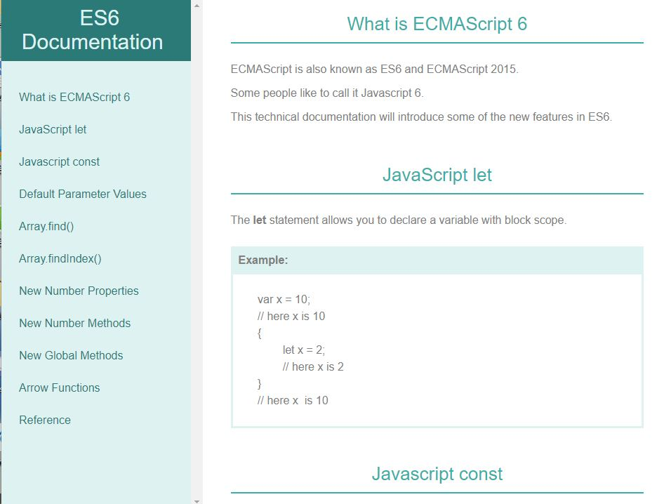
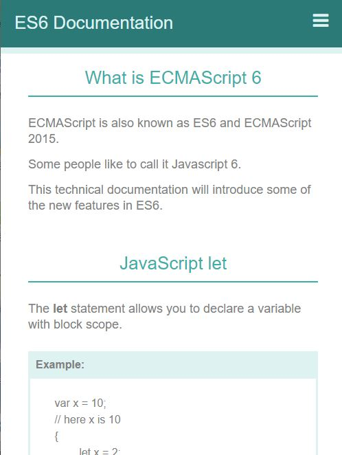
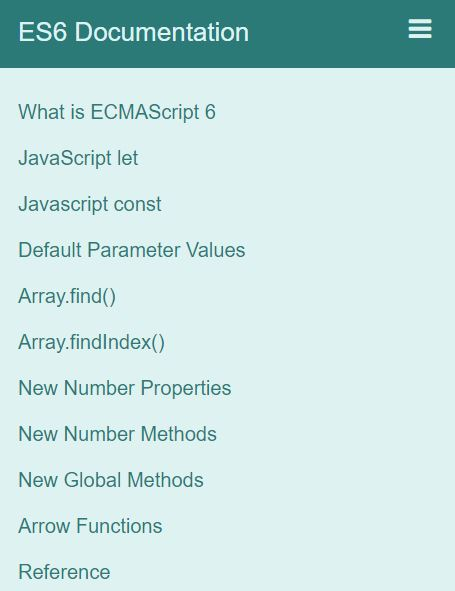

# FreeCodeCamp Project
- Technical Documentation Page
### Screenshots

##### Bigger screen screenshot

##### Smaller screen screenshot
             
- Scrolling up and down will trigger navigation bar to show or hide it
### Project Requirements	
* Main element with id="main-doc"
	- With several section with class=main-section
	- Each .main-section have header element, should have min. of 5 .main-section
	- Each .main-section should have id corresponds with the text of each header
	- .main-section should contain at least 10 P element
	- .main-section should contain at least 5 code element total
	- .main-section should contain at least 5 li items total not each
* nav element with id="navbar" 
	- nav element should contain one header
	- nav bar should contain link that link to the corresponding main-section
			-On regular sized devices, nav should show on the left side of the screen
		* Use at least one media query
#### Original project description
https://learn.freecodecamp.org/responsive-web-design/responsive-web-design-projects/build-a-technical-documentation-page
